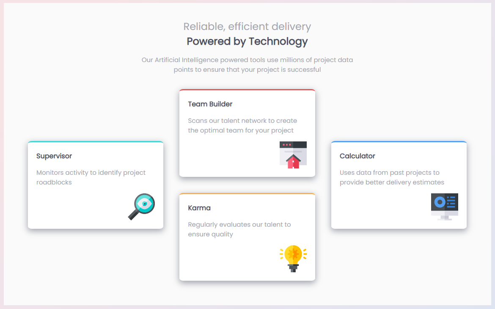
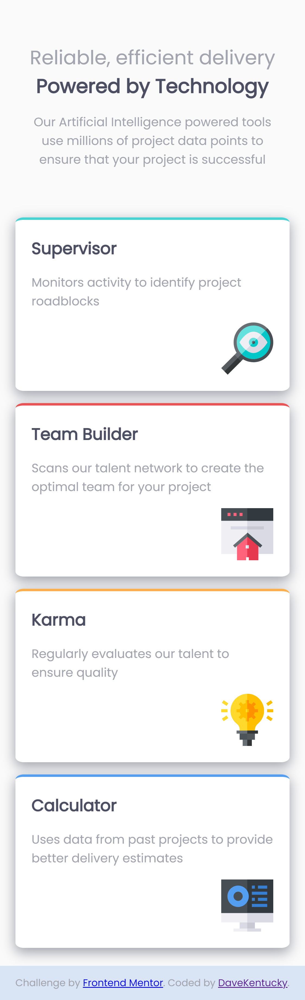

# Frontend Mentor - Four card feature section solution

This is a solution to the [Four card feature section challenge on Frontend Mentor](https://www.frontendmentor.io/challenges/four-card-feature-section-weK1eFYK). Frontend Mentor challenges help you improve your coding skills by building realistic projects. 

## Table of contents

- [Overview](#overview)
  - [The challenge](#the-challenge)
  - [Screenshot](#screenshot)
  - [Links](#links)
- [My process](#my-process)
  - [Built with](#built-with)
  - [What I learned](#what-i-learned)
  - [Continued development](#continued-development)
- [Author](#author)

## Overview

### The challenge

Users should be able to:

- View the optimal layout for the site depending on their device's screen size

### Screenshot

### Links

- Solution URL: [https://davekentucky.github.io/Frontend-four-cards/index.html](https://davekentucky.github.io/Frontend-four-cards/index.html)

## My process

### Built with

- Semantic HTML5 markup
- CSS custom properties
- Flexbox
- CSS Grid
- [Eggradients](https://www.eggradients.com/)

### What I learned

In this exercise I cpuld polish up my skills of using grids and flexboxes in CSS for styling websites in a modern way. The most interesting was probably the usage of borders shown in the template design. This task was also a great opportunity to focus even more on mobile design, which is crucial in web design nowadays.

### Continued development

After the completion of this task I want to focus even more on manipuating fonts and colors in web design. Another thing is grid display, which still needs more practice to get really comfortable with. I am also going to try another way to simplify CSS modification (SASS or Bootstrap).

## Author

- LinkedIn - [Dawid Marczewski](https://www.linkedin.com/in/dawid-marczewski-73a75a1bb/)
- Frontend Mentor - [@DaveKentucky](https://www.frontendmentor.io/profile/yourusername)
